<div align="center">


<h1>Databricks Unity Catalog Blueprint</h1>

<p><strong>The Institutional-Grade Platform for Standardized Lakehouse Foundations, Unified Governance Orchestration, and Multi-Cloud Data Ecosystems.</strong></p>

[]()
[]()
[]()

<br/>

> **"Industrializing data access to automate governance foundations."** 
> **Databricks Unity Catalog Blueprint** is an enterprise-grade solution designed to provide a secure, measurable, and highly automated foundation for global Lakehouse operations. It orchestrates the complex lifecycle of unified governance—from metastore instantiation and catalog hierarchy automation to fine-grained access control (FGAC) and unified lineage auditing.

</div>

---

## 🏛️ Executive Summary

Fragmented workspace silos and manual table grants are strategic operational liabilities; lack of centralized Lakehouse orchestration is a primary barrier to organizational data democratization and compliance maturity. Organizations fail to maintain a secure data foundation not because of a lack of storage, but because of fragmented security standards, lack of automated lineage validation, and an inability to orchestrate governance planes with operational precision.

This repository provides the **Lakehouse Intelligence Plane**. It implements a complete **UC-Blueprint-as-Code Framework**, enabling Data Platform and Security teams to manage global Unity Catalog foundations as first-class citizens. By automating the identification of access bottlenecks through real-time telemetry analysis and orchestrating the provisioning of secure performance-driven sharing policies, we ensure that every organizational data asset—from raw Bronze tables to refined Gold models—is governed by default, audited for history, and strictly aligned with institutional unified security frameworks.

---

## 📐 Architecture Storytelling: Principal Reference Models

### 1. Principal Architecture: Global Databricks Unity Catalog & Lakehouse Governance Plane
This diagram illustrates the end-to-end flow from data ingestion and multi-cloud orchestration to access enforcement, policy validation, and institutional maturity auditing.

```mermaid
graph LR
    %% Subgraph Definitions
    subgraph DataIngress["Data & Storage Ingress"]
        direction TB
        Cloud_Storage["S3 / ADLS / GCS"]
        Ext_Systems["Snowflake / PostgreSQL (Federation)"]
        Access_Guardrails["Identity Mgmt / SCIM Sync"]
    end

    subgraph IntelligenceEngine["Lakehouse Intelligence Hub"]
        direction TB
        API["FastAPI Governance Gateway"]
        UCOrchestrator["Global Unity Catalog & IAM Hub"]
        Governance_Hub["Compliance & Policy Guardrail Hub"]
        AIOps_Validator["Drift & Access Analysis Hub"]
    end

    subgraph OperationsPlane["Distributed Governance Ecosystem"]
        direction TB
        ManagedWorkspaces["Managed Standardized Databricks Workspaces"]
        ActiveCatalogs["Managed Automated Catalog Hierarchies"]
        SharingSinks["Managed Delta Sharing Hubs"]
    end

    subgraph OperationsHub["Institutional Lakehouse Hub"]
        direction TB
        Scorecard["Governance Maturity Scorecard"]
        Analytics["Access Flow & Readiness Velocity Stats"]
        Audit["Forensic Lineage Metadata Lake"]
    end

    subgraph DevOps["UC-Blueprint-as-Code Framework"]
        direction TB
        TF["Terraform Metastore Modules"]
        DriftBot["Grant & Config Drift Validator"]
        ChatOps["Platform Operations Hub"]
    end

    %% Flow Arrows
    DataIngress -->|1. Register Asset| API
    API -->|2. Orchestrate UC| UCOrchestrator
    UCOrchestrator -->|3. Apply Security Guard| Governance_Hub
    Governance_Hub -->|4. Assess Drift| AIOps_Validator
    
    AIOps_Validator -->|5. Execute Assignment| OperationsPlane
    OperationsPlane -->|6. Notify Status| ChatOps
    API -->|7. Visualize Health| Scorecard
    
    Scorecard -->|8. Track Maturity| Analytics
    Scorecard -->|9. Record Access| Audit
    
    TF -->|10. Provision Backbone| IntelligenceEngine
    DriftBot -->|11. Inject Compliance Risk| UCOrchestrator
    Audit -->|12. Improve Operations| ManagedWorkspaces

    %% Styling
    classDef ingress fill:#f5f5f5,stroke:#616161,stroke-width:2px;
    classDef intel fill:#e8eaf6,stroke:#1a237e,stroke-width:2px;
    classDef operations fill:#e1f5fe,stroke:#01579b,stroke-width:2px;
    classDef ops fill:#ede7f6,stroke:#311b92,stroke-width:2px;
    classDef devops fill:#e8f5e9,stroke:#1b5e20,stroke-width:2px;

    class DataIngress ingress;
    class IntelligenceEngine intel;
    class OperationsPlane operations;
    class OperationsHub ops;
    class DevOps devops;
```

### 2. The Governance Lifecycle Flow
The continuous path of a Unity Catalog platform from initial provisioning (metastore) and organization (catalog/schema) to active security (grants), sharing (Delta Sharing), and institutional forensic auditing (lineage).

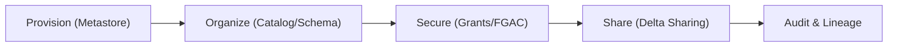

### 3. Distributed Governance Topology
Strategically orchestrating standardized Unity Catalog deployments across global workspaces, diverse cloud regions, and multi-cloud platforms, providing a unified institutional view of global data security.

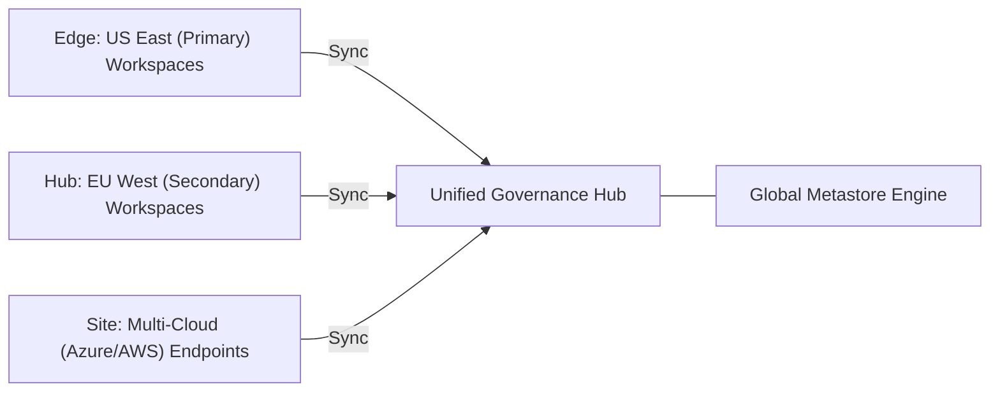

### 4. Lakehouse Governance & High-Trust Data Plane Protection Flow
Executing complex logic for securing the bridge between cloud storage, compute clusters, and BI tools, ensuring every organizational identity is verified and every data access is according to institutional standards.

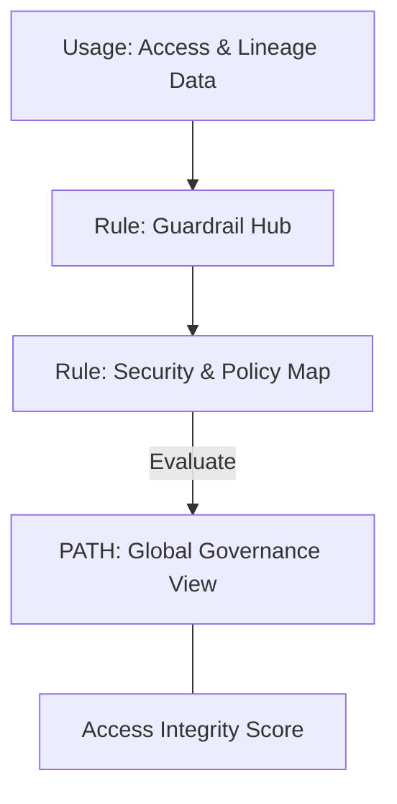

### 5. Multi-Cloud Federation & Unified Governance Flow
Automatically managing unified access policies across Azure Databricks, AWS Databricks, and GCP Databricks, ensuring institutional security consistency and data boundaries by default.

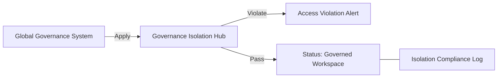

### 6. Encryption & Perimeter Protection Flow (Lakehouse Standard)
Managing the lifecycle of a workspace request, automatically enforcing institutional TLS 1.3, Private Link integration, and CMK (Customer Managed Key) encryption standards as required by security policy.

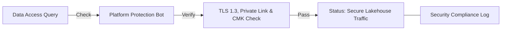

### 7. Institutional Lakehouse Maturity Scorecard
Grading organizational performance based on key indicators: FGAC (Fine-Grained Access Control) Adoption, Data Lineage Coverage, and Stale Data Reduction.

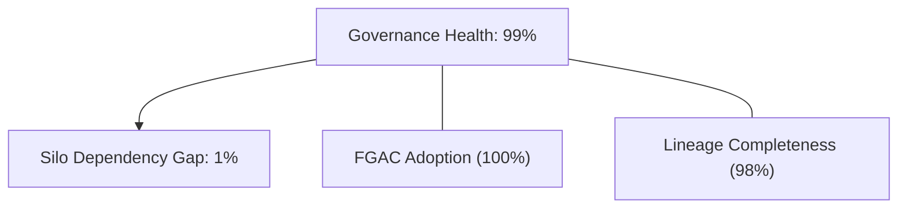

### 8. Identity & RBAC for Lakehouse Governance
Managing fine-grained access to metastores, catalog hierarchies, and audit logs between Metastore Admins, Workspace Admins, and Data Stewards.

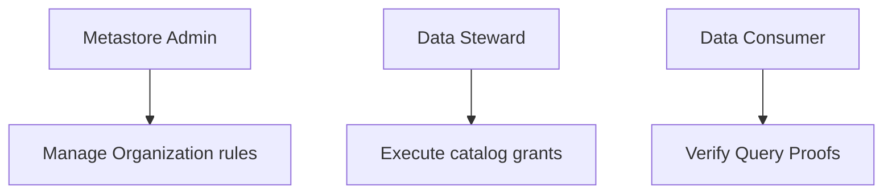

### 9. IaC Deployment: UC-Blueprint-as-Code Framework
Using modular Terraform to deploy and manage the versioned distribution of the governance tracking hubs, policy protection workers, and forensic metadata lakes.

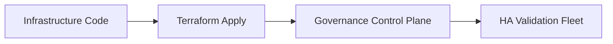

### 10. AIOps Data Access Drift & Risk Validation Flow
Using advanced analytics to identify sudden surges in denied queries, unauthorized sharing attempts, suspicious configuration drifts, or unusual access pattern changes that could result in institutional risk or data exfiltration.

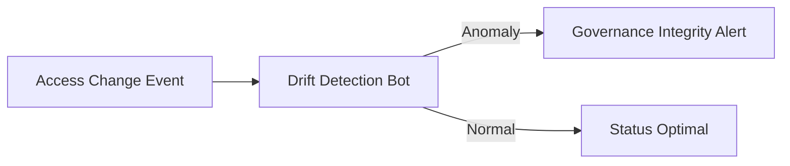

### 11. Metadata Lake for Forensic Governance Audit
Storing long-term records of every catalog creation event generated (metadata), every grant execution triggered, and every lineage tracking history for institutional record-keeping, compliance auditing, and post-provisioning forensics.

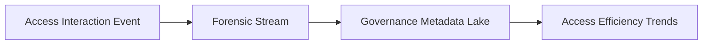

---

## 🏛️ Core Governance Pillars

1.  **Unified Foundation Coordination**: Maximizing security by centralizing all lakehouse workflows through a single institutional plane.
2.  **Automated Catalog Provisioning**: Eliminating "manual grants" scenarios through proactive orchestration and template verification.
3.  **Sequential Policy Intelligence**: Ensuring zero-interruption operations through dependency-aware Unity Catalog-driven platform engineering.
4.  **Zero-Trust Guardrail Protection**: Automatically enforcing identity-based access and FGAC evaluation across all data tiers.
5.  **Autonomous Operations Logic**: Guaranteeing reliability through automated industry-specific compliance monitoring runbooks.
6.  **Full Governance Auditability**: Immutable recording of every lineage event and Delta Share provision for institutional forensics.

---

## 🛠️ Technical Stack & Implementation

### Governance Engine & APIs
*   **Framework**: Python 3.11+ / FastAPI.
*   **Performance Engine**: Custom Python-based logic for multi-cloud Unity Catalog provisioning and compliance readiness metrics.
*   **Integrations**: Native connectors for Databricks SDK, SCIM, Delta Sharing, and Terraform Enterprise.
*   **Persistence**: PostgreSQL (Governance Ledger) and Redis (Live Access State).
*   **Auth Orchestrator**: Federated OIDC/SAML for least-privilege catalog management access.

### Governance Dashboard (UI)
*   **Framework**: React 18 / Vite.
*   **Theme**: Dark, Slate, Indigo (Modern high-fidelity governance aesthetic).
*   **Visualization**: D3.js for lineage topologies and Recharts for access velocity analytics.

### Infrastructure & DevOps
*   **Runtime**: AWS EKS or Azure Kubernetes Service (AKS) for management plane.
*   **Governance Hub**: Managed event sourcing for immutable audit timeline reconstruction.
*   **IaC**: Modular Terraform for deploying the metastore backbone and validation fleet.

---

## 🏗️ IaC Mapping (Module Structure)

| Module | Purpose | Real Services |
| :--- | :--- | :--- |
| **`infrastructure/governance_hub`** | Central management plane | EKS, PostgreSQL, Redis |
| **`infrastructure/metastore_workers`** | Distributed automation workers | Azure, AWS, GCP APIs |
| **`infrastructure/grant_pipes`** | Policy Orchestration Hubs | Webhooks, GitHub Actions |
| **`infrastructure/auditing`** | Forensic lineage sinks | S3, Athena, Databricks SQL |

---

## 🚀 Deployment Guide

### Local Principal Environment
```bash
# Clone the Unity Catalog Blueprint repository
git clone https://github.com/devopstrio/databricks-unity-catalog-blueprint.git
cd databricks-unity-catalog-blueprint

# Configure environment
cp .env.example .env

# Launch the Governance stack
make init

# Trigger a mock UC request and automated guardrail validation simulation
make simulate-governance
```

Access the Management Portal at `http://localhost:3000`.

---

## 📜 License
Distributed under the MIT License. See `LICENSE` for more information.

---
<div align="center">
  <p>© 2026 Devopstrio. All rights reserved.</p>
</div>
