<div align="center">


<h1>Databricks Unity Catalog Blueprint</h1>

<p><strong>The Enterprise Standard for Designing, Deploying, and Automating Global Lakehouse Governance</strong></p>

[]()
[]()
[]()
[]()

<br/>

> **"Data is an asset only when it is governed, secure, and discoverable."** 
> Databricks Unity Catalog Blueprint is a flagship platform designed to enable enterprises to design, deploy, and scale unified governance across multi-cloud lakehouse environments.

</div>

---

## 🏛️ Executive Summary

**Databricks Unity Catalog Blueprint** is a flagship repository designed for Chief Data Officers (CDOs), Data Platform Leads, and Security Architects. As organizations transition to the Lakehouse architecture, the "Data Silo" problem is replaced by the "Governance Complexity" problem.

This platform provides an industrialized approach to **Unified Governance**, delivering production-ready **Metastore Deployments**, **Automated Catalog Hierarchies**, **Fine-Grained Access Control (FGAC) Workflows**, and **Lineage Dashboards**. It supports **Azure**, **AWS**, and **GCP**, enabling teams to manage thousands of schemas and tables with a single, consistent security model.

---

## 💡 Why Unity Catalog Matters

Unity Catalog is the "Brain" of the Databricks Lakehouse:
- **Centralized Metadata**: Unified view of all data assets across workspaces and clouds.
- **Unified Security Model**: One place to define access for SQL, Python, Scala, and BI tools.
- **End-to-End Lineage**: Tracking data from ingestion to consumption for compliance and impact analysis.
- **Data Sharing (Delta Sharing)**: Secure, open protocol for sharing data with internal and external consumers without egress costs.

---

## 🚀 Business Outcomes

### 🎯 Strategic Governance Impact
- **Accelerated Time-to-Insight**: Reducing data access request fulfillment from days to minutes through self-service.
- **Consistent Security**: Eliminating the risk of misconfiguration across diverse cloud environments.
- **Improved Compliance**: Providing auditors with automated evidence of lineage, access, and sensitive data handling.
- **Resource Optimization**: Identifying and retiring stale data assets through usage-based observability.

---

## 🏗️ Technical Stack

| Layer | Technology | Rationale |
|---|---|---|
| **Governance Engine** | Python, Databricks SDK | High-performance automation of grant management and policy application. |
| **Control Plane** | FastAPI | High-performance API for catalog management and request orchestration. |
| **Frontend** | React 18, Vite | Premium portal for catalog explorer, lineage center, and governance scorecards. |
| **IaC Foundation** | Terraform | Multi-cloud infrastructure consistency and workspace automation. |
| **Database** | PostgreSQL | Centralized repository for governance metadata, policies, and state. |
| **Observability** | Prometheus / Grafana | Real-time monitoring of policy violations and lineage sync health. |

---

## 📐 Architecture Storytelling: 65+ Diagrams

### 1. Executive High-Level Architecture
The holistic vision of the enterprise governance journey.

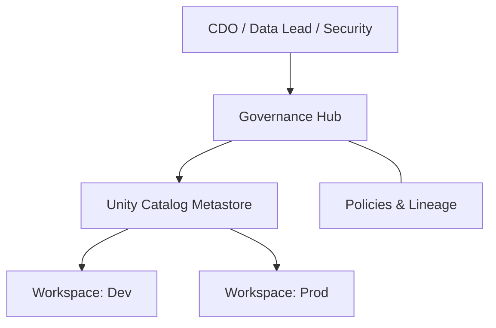

### 2. Detailed Component Topology
The internal service boundaries and management layers of the platform.

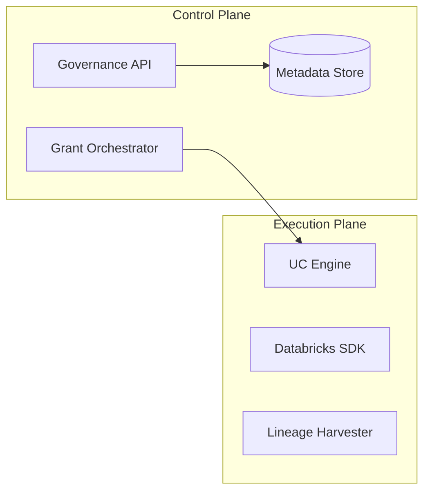

### 3. Frontend to Backend Request Path
Tracing a "Create Catalog" request through the stack.

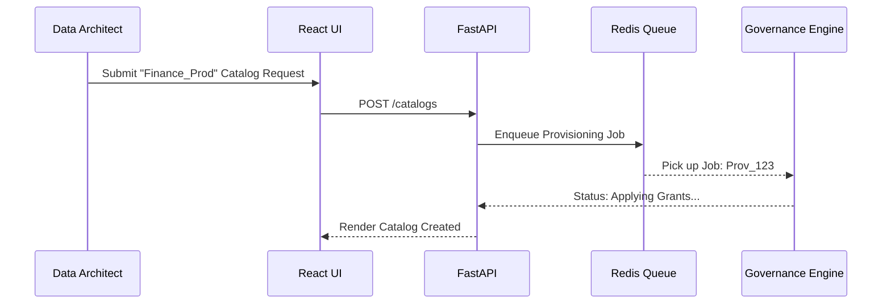

### 4. Unity Catalog Control Plane
The "Brain" of the framework managing multi-workspace governance definitions.

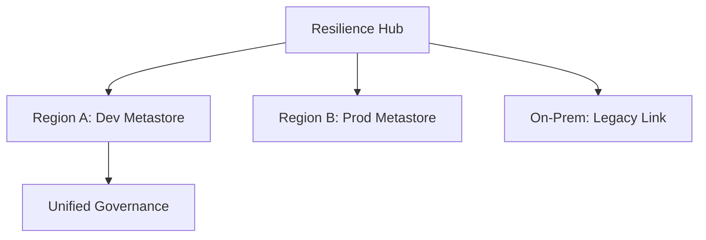

### 5. Multi-cloud Databricks Topology
Synchronizing governance standards across Azure, AWS, and GCP.

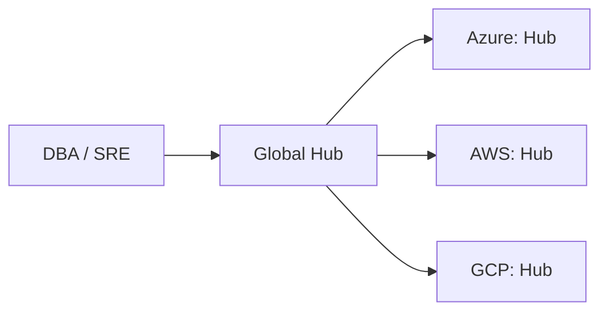

### 6. Regional Deployment Model
Hosting governance workers close to the workspaces for performance.

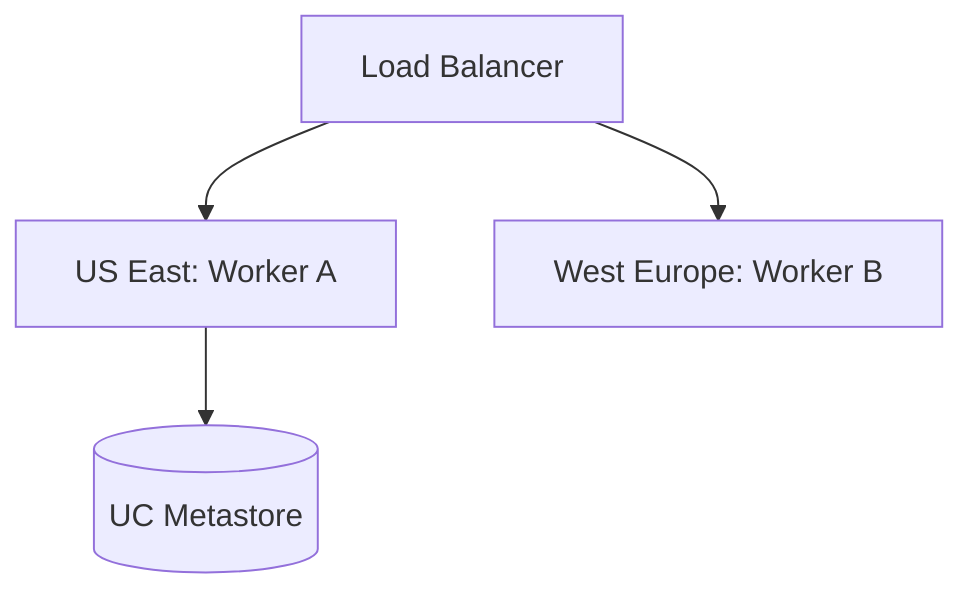

### 7. DR Failover Model
Ensuring governance continuity during regional cloud outages.

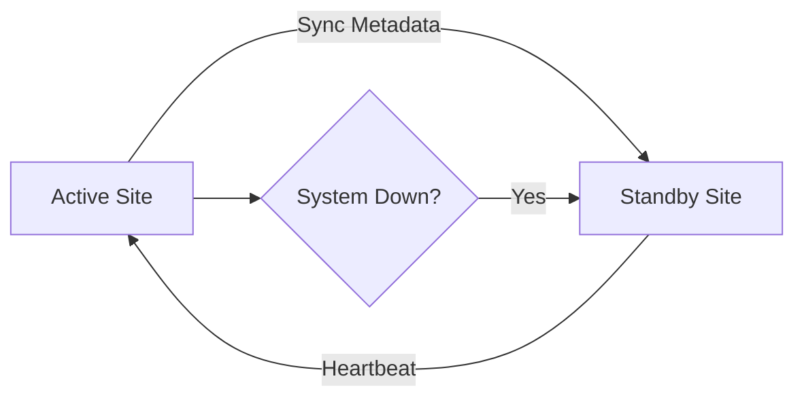

### 8. API Gateway Architecture
Securing and throttling the entry point for governance orchestration.

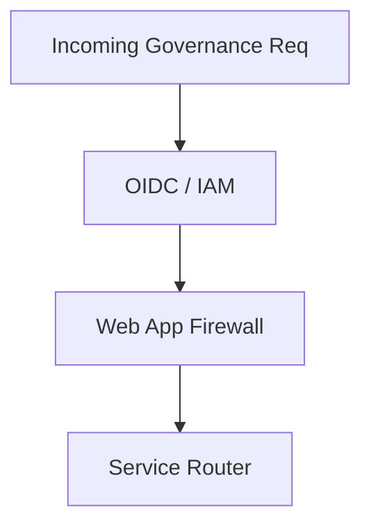

### 9. Queue Worker Architecture
Managing long-running provisioning and sync tasks at scale.

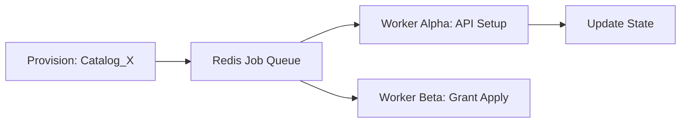

### 10. Dashboard Analytics Flow
How raw governance telemetry becomes executive resilience scorecards.

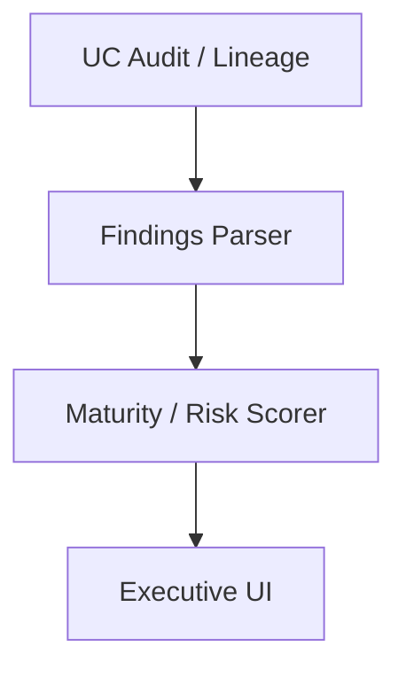

### 11. Metastore to Workspace Assignment
Centralized metadata serving multiple compute environments.

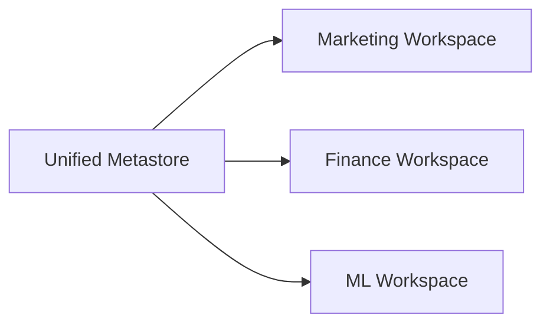

### 12. Catalog Hierarchy Model
Standardized organization: Catalog > Schema > Table/View/Function.

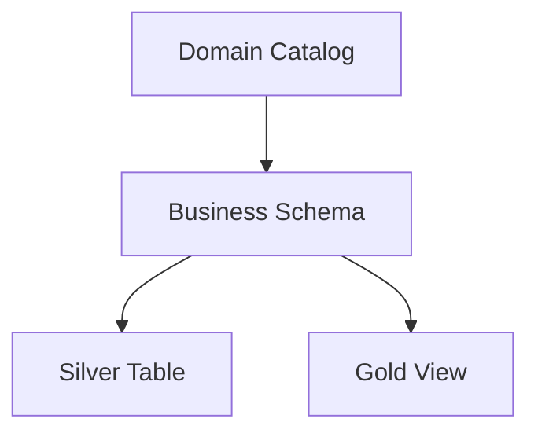

### 13. Schema Ownership Workflow
Defining and enforcing accountability at the schema level.

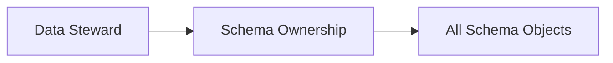

### 14. Table Governance Lifecycle
From creation to retirement under UC control.

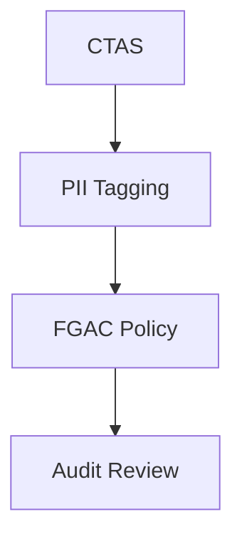

### 15. View Security Model
Abstracting complex security logic through dynamic views.

```mermaid
graph LR
    Users[Users] --> View[Secure View]
    View --> Logic[is_member('Finance')]
    Logic --> Table[Raw Table]
```

### 16. Managed Table Storage Flow
Databricks managed storage in root cloud buckets.

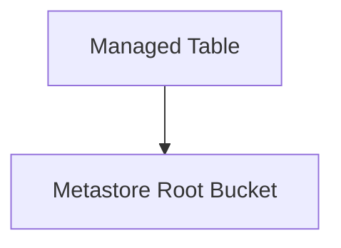

### 17. External Table Workflow
Governing data staying in external cloud storage locations.

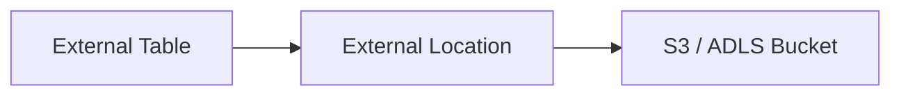

### 18. External Location Mapping
Registering cloud storage as governed locations in UC.

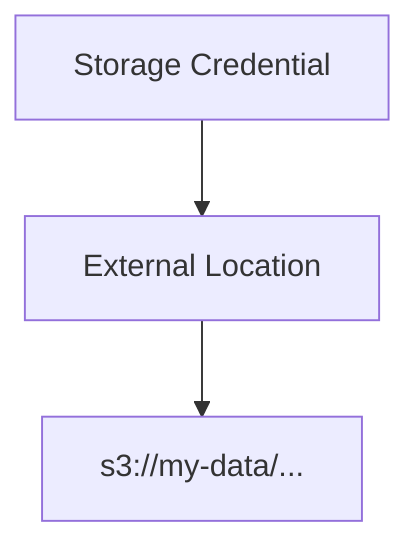

### 19. Storage Credential Lifecycle
Automating IAM role / Service Principal rotation for UC.

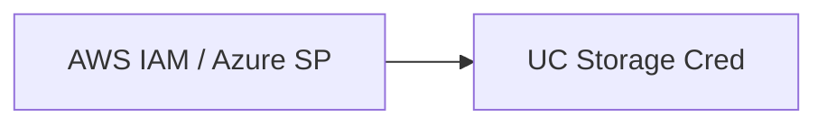

### 20. Naming Standards Model
Enforcing enterprise naming conventions through validation.

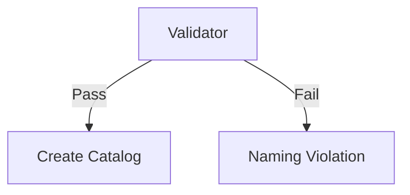

### 21. RBAC Model
Role-Based Access Control for catalogs and schemas.

```mermaid
graph LR
    Role[Data Scientist] --> Grants[USAGE on Catalog]
    Grants --> Tables[SELECT on Table]
```

### 22. ABAC Tag-Based Model
Attribute-Based Access Control using sensitive data tags.

```mermaid
graph TD
    Tag[PII] --> Policy[Mask Column]
```

### 23. Row-Level Security Flow
Filtering data based on user identity or group membership.

```mermaid
graph LR
    User[User A] --> Filter[Row Filter]
    Filter --> Data[Allowed Rows]
```

### 24. Column Masking Workflow
Redacting sensitive values for unauthorized users.

```mermaid
graph TD
    User[Analyst] --> Mask[Masking Function]
    Mask --> Result[XXXX-XXXX]
```

### 25. Dynamic View Security
Combining filters and masks into a single secure interface.

```mermaid
graph LR
    App[BI App] --> View[Dynamic View]
```

### 26. Group Provisioning Lifecycle
Syncing enterprise identities to UC groups.

```mermaid
graph TD
    IDP[Entra ID / Okta] --> SCIM[SCIM Sync]
    SCIM --> UC_Groups[UC Groups]
```

### 27. SSO Federation Model
Centralized authentication for the Databricks control plane.

```mermaid
graph LR
    User[User] --> SSO[SAML / OIDC]
    SSO --> Console[Databricks Console]
```

### 28. Privileged Access Workflow
Governing Metastore Admin and Workspace Admin permissions.

```mermaid
graph TD
    Admin[Admin] --> PIM[JIT Approval]
```

### 29. Break-Glass Governance Model
Procedures for emergency global access to the metastore.

```mermaid
graph LR
    Emergency[Outage] --> Key[Secure Vault Key]
    Key --> Admin[Emergency Admin]
```

### 30. Access Review Cadence
Periodic re-certification of data permissions.

```mermaid
graph TD
    Quarter[Q-Review] --> Owner[Review Grants]
```

### 31. End-to-End Lineage Flow
Visualizing data flow from source to dashboard.

```mermaid
graph LR
    Source[Raw S3] --> Bronze[Bronze Table]
    Bronze --> Silver[Silver Table]
    Silver --> Gold[Gold Table]
```

### 32. dbt Lineage Integration
Connecting dbt model lineage to Unity Catalog.

```mermaid
graph TD
    dbt[dbt Cloud] --> API[UC Lineage API]
```

### 33. Notebook Lineage Workflow
Capturing table dependencies from interactive analysis.

```mermaid
graph LR
    Notebook[User Notebook] --> SQL[Queries]
    SQL --> Lineage[Lineage Graph]
```

### 34. Audit Log Pipeline
Consolidating cloud and Databricks audit events.

```mermaid
graph TD
    Cloud[AWS/Azure Audit] --> Hub[Audit Lake]
    UC[UC Audit] --> Hub
```

### 35. Evidence Collection Model
Automating the gathering of governance proof for auditors.

```mermaid
graph LR
    Audit[Audit] --> Report[Compliance Doc]
```

### 36. Sensitive Data Tagging Flow
Automated discovery and tagging of PII/PHI.

```mermaid
graph TD
    Scanner[Sensitive Scanner] --> Tag[Tag: Sensitive]
```

### 37. Retention Governance Model
Automating the deletion of expired data assets.

```mermaid
graph LR
    Policy[TTL: 7 Years] --> Purge[Automated Purge]
```

### 38. Policy Exception Workflow
Governing temporary overrides of security guardrails.

```mermaid
graph TD
    Exception[Request] --> Approval[DPO Sign-off]
```

### 39. Risk Review Lifecycle
Identifying and mitigating data governance hotspots.

```mermaid
graph LR
    Data[Stats] --> Review[Risk Heatmap]
```

### 40. Regulatory Reporting Workflow
Generating GDPR/CCPA data maps from UC metadata.

```mermaid
graph TD
    Maps[Data Maps] --> Regulatory[Submission]
```

### 41. Delta Sharing Architecture
The open protocol for secure data exchange.

```mermaid
graph LR
    Provider[Data Provider] --> Share[Delta Share]
    Share --> Consumer[Open Client]
```

### 42. Internal Sharing Model
Sharing data across different metastores or clouds within the company.

```mermaid
graph TD
    Metastore_A[US Metastore] --> Share[Internal Share]
    Share --> Metastore_B[EU Metastore]
```

### 43. External Consumer Sharing Flow
Onboarding third-party partners without Databricks accounts.

```mermaid
graph LR
    Partner[Partner] --> Token[Activation Link]
```

### 44. Cross-Region Sharing Pattern
Minimizing latency and egress for global data consumers.

```mermaid
graph TD
    Hub[Main Region] --> Replica[Local Share Replica]
```

### 45. Cross-Cloud Sharing Model
Bridging Azure, AWS, and GCP data silos.

```mermaid
graph LR
    Azure[Azure Data] --> Share[Delta Share]
    Share --> AWS[AWS Analytics]
```

### 46. BI Tool Access Workflow
Securely connecting Power BI, Tableau, and Looker via UC.

```mermaid
graph TD
    BI[BI Tool] --> SQL[Warehouse]
    SQL --> UC[Unity Catalog]
```

### 47. ML Feature Access Model
Governing access to features in the Feature Store.

```mermaid
graph LR
    Model[ML Model] --> Feature[UC Table]
```

### 48. Semantic Model Integration
Linking UC metadata to business definitions.

```mermaid
graph TD
    UC[Physical Table] --> Semantic[Business Term]
```

### 49. Federated Query Pattern
Querying external databases (SQL, Snowflake) through UC.

```mermaid
graph LR
    UC[Unity Catalog] --> Lakehouse[Lakehouse Fed]
    Lakehouse --> Ext[External DB]
```

### 50. Consumer Onboarding Flow
The journey from sharing request to data access.

```mermaid
graph TD
    Req[Access Req] --> Onboard[Onboarding]
```

### 51. Terraform Deployment Workflow
Industrializing the rollout of metastores and catalogs.

```mermaid
graph LR
    Git[Code] --> TF[Terraform Apply]
```

### 52. CI/CD Pipeline Model
Automating governance updates through GitHub Actions.

```mermaid
graph TD
    Push[Git Push] --> Test[Policy Test]
    Test --> Deploy[GHA Deploy]
```

### 53. Drift Detection Lifecycle
Ensuring grants in UC match the desired state in Git.

```mermaid
graph LR
    UC[UC State] --> Compare[Drift Check]
    Compare --> Git[Git Repo]
```

### 54. Metrics Pipeline
Monitoring the performance of the governance hub.

```mermaid
graph TD
    Hub[Hub] --> Prom[Prometheus]
```

### 55. Logging Architecture
Centralized governance platform logs.

```mermaid
graph LR
    Pod[Hub Pod] --> Loki[Grafana Loki]
```

### 56. Tracing Model
Tracing provisioning requests across distributed workers.

```mermaid
graph TD
    Req[Start] --> Trace[OTel Trace]
```

### 57. SLA Monitoring Flow
Tracking the time-to-access for new data consumers.

```mermaid
graph LR
    Start[Request] --> End[Access Granted]
    End --> Calc[Duration: 10m]
```

### 58. Incident Response Workflow
Automating lock-down of assets during a suspected breach.

```mermaid
graph TD
    Alert[Breach] --> Lockdown[Revoke All USAGE]
```

### 59. Cost Allocation Model
Attributing storage and compute costs to business domains.

```mermaid
graph LR
    Usage[Usage Stats] --> Billing[Department Chargeback]
```

### 60. Release Pipeline Workflow
Continuous delivery of the governance blueprints.

```mermaid
graph TD
    Dev[Dev] --> Prod[Prod]
```

### 61. Executive KPI Review Cycle
Reporting governance health to the CDO.

```mermaid
graph LR
    Stats[Health Stats] --> Slide[CDO Deck]
```

### 62. Governance Scorecard Workflow
Ranking domains by their compliance and adoption scores.

```mermaid
graph TD
    Domains[Domains] --> Score[A: Finance, C: Marketing]
```

### 63. Domain Ownership Model
Mapping business owners to technical catalogs.

```mermaid
graph LR
    Dept[HR] --> Catalog[hr_prod_catalog]
```

### 64. Adoption Maturity Roadmap
The journey from manual tagging to autonomous governance.

```mermaid
graph TD
    P1[Initial] --> P4[Optimized]
```

### 65. Quarterly Operating Cadence
The rhythm of governance reviews and policy updates.

```mermaid
graph LR
    Q1[Catalog Rollout] --> Q4[Full Lineage]
```

---

## 🔬 Unity Catalog Governance Methodology

### 1. The Governance Pillars
Our platform is built on four core pillars:
- **Unified**: One security model for all data and AI assets across all clouds.
- **Automated**: Eliminating manual bottlenecking through policy-as-code.
- **Observable**: Full visibility into lineage, usage, and access patterns.
- **Open**: Leveraging Delta Sharing to enable seamless collaboration without vendor lock-in.

### 2. Catalog / Schema Design Framework
- **Domain-Driven**: Organizing catalogs by business domain (Finance, Sales, HR).
- **Environment-Isolated**: Separating dev, staging, and prod catalogs.
- **Standardized Hierarchies**: Enforcing consistent schema names (raw, silver, gold) across all catalogs.

---

## 🚦 Getting Started

### 1. Prerequisites
- **Terraform** (v1.5+).
- **Docker Desktop**.
- **Azure/AWS/GCP CLI** configured.
- **Databricks Account Admin** access.

### 2. Local Setup
```bash
# Clone the repository
git clone https://github.com/Devopstrio/databricks-unity-catalog-blueprint.git
cd databricks-unity-catalog-blueprint

# Start the Governance Control Plane
docker-compose up --build
```
Access the Governance Portal at `http://localhost:3000`.

---

## 🛡️ Governance & Security
- **Metastore-Level Security**: Centralized administration of global governance settings.
- **Fine-Grained Controls**: Implementing row-level filters and column-level masks as standard.
- **Audit-Ready**: Every access request, grant change, and data query is logged and traceable.

---
<sub>&copy; 2026 Devopstrio &mdash; Engineering the Future of Industrialized Lakehouse Governance.</sub>
